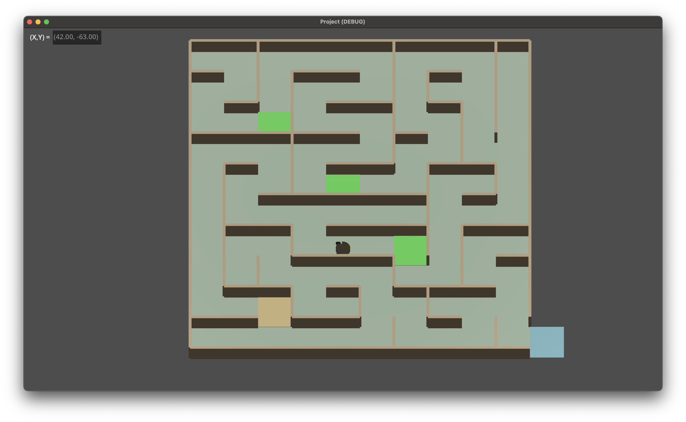

# 🤖 Q-Learning Maze Robot

A reinforcement learning system for training a differential drive robot to navigate a complex maze. This project integrates a physics-based Godot simulation with an advanced Q-Learning agent featuring a dynamic, curiosity-driven exploration strategy.

[](https://python.org)
[](https://godotengine.org)
[](LICENSE)
[](https://jupyter.org)

## Theoretical Background

*Q-learning* algorithm is a model-free reinforcement learning algorithm that learns the value of an action in a particular state. It does this by updating a Q-table, which stores the expected utility of taking a given action in a given state. The agent explores the environment, receives rewards, and updates its Q-values based on the following equation:

$$
Q(s_t, a_t) \leftarrow Q(s_t, a_t) + \alpha \left[ r_{t+1} + \gamma \cdot \underset{a'}{\arg\max} \ Q(s_{t+1}, a') - Q(s_t, a_t) \right]
$$

where:
-  $Q(s, a)$ is the Q-value for state $s$ and action $a$.
- $\alpha$ is the learning rate.
- $r_t$ is the reward received at time $t$.
- $\gamma$ is the discount factor, which determines the importance of future rewards.
- $s_{t+1}$ is the next state after taking action $a$ in state $s$.


## 📋 Table of Contents

- [🤖 Q-Learning Maze Robot](#-q-learning-maze-robot)
  - [Theoretical Background](#theoretical-background)
  - [📋 Table of Contents](#-table-of-contents)
  - [🎯 Overview](#-overview)
  - [✨ Key Features](#-key-features)
    - [🧠 Machine Learning](#-machine-learning)
    - [🤖 Robotics \& Simulation](#-robotics--simulation)
    - [🛠️ Development \& Usability](#️-development--usability)
  - [🏗️ System Architecture](#️-system-architecture)
  - [🚀 Quick Start](#-quick-start)
    - [Prerequisites](#prerequisites)
    - [Installation](#installation)
    - [Running the System](#running-the-system)
  - [🎮 Usage](#-usage)
    - [Interactive Menu](#interactive-menu)
    - [Command-Line Interface (for automation)](#command-line-interface-for-automation)
  - [⚙️ Configuration](#️-configuration)
    - [Example `config.yaml`](#example-configyaml)
    - [Reward Engineering](#reward-engineering)
  - [📊 Analysis and Visualization](#-analysis-and-visualization)
  - [📁 Project Structure](#-project-structure)
  - [🤝 Contributing](#-contributing)
  - [📄 License](#-license)

## 🎯 Overview

This project implements a complete reinforcement learning pipeline for a robot navigating a maze. The core of the system is a **Q-Learning agent** that learns optimal paths through trial and error. It interacts with a **Godot Engine simulation** via a DDS (Data Distribution Service) communication layer based on the publisher-subscriber pattern.

The agent's learning is guided by a **Curiosity-driven exploration strategy**, which dynamically adjusts its exploration rate based on state novelty. This encourages the robot to thoroughly explore the maze instead of getting stuck in local optima. The reward system is designed with **progressive checkpoints** to provide intermediate goals, making it feasible to solve large, complex mazes with sparse final rewards.

<div style="text-align: center;">
  
</div>

The system has been tested on a 10x10 maze, achieving convergence in approximately 700 episodes, as shown in the plot below:

<div style="text-align: center;">
  
</div>

The plot shows the reward per episode over time, demonstrating the agent's learning progress. The moving average line indicates a consistent improvement in performance, with the agent successfully navigating the maze and reaching the goal.

## ✨ Key Features

### 🧠 Machine Learning
- **Advanced Q-Learning**: Tabular Q-Learning with learning rate decay for fine-tuning.
- **Dynamic Curiosity Strategy**: Exploration is driven by state visitation counts and action novelty, making it highly effective for complex environments.
- **Progressive Checkpoint Rewards**: An escalating reward system that provides increasing bonuses for reaching sequential checkpoints, guiding the agent toward the final goal.
- **Loop Detection & Penalization**: Automatically penalizes repetitive, inefficient behavior to encourage progress.

### 🤖 Robotics & Simulation
- **Differential Drive Physics**: The agent controls a simulated robot with realistic two-wheeled physics, managed by PID controllers.
- **Decoupled Architecture**: Python-based RL brain communicates with a Godot Engine simulation via a DDS layer.
- **Flexible Simulation Modes**: Choose at launch between two distinct movement modes, independent of training or testing:
  - **Fast Mode**: A "teleport" mode for rapid, physics-less iteration, ideal for quickly training and testing learning logic.
  - **Real Mode**: A full physics simulation using PID controllers for realistic evaluation of the trained policy.
- **Collision Handling**: Automatic collision detection and a backup-maneuver routine in Real Mode.

### 🛠️ Development & Usability
- **Centralized Configuration**: A single, comprehensive `config.yaml` file to manage all high-level parameters.
- **CLI & Interactive Modes**: Run training via command-line arguments for automation or use the interactive menu for experimentation.
- **Model Persistence**: Save and resume training progress, including the Q-table and strategy state.
- **Detailed Logging**: Formatted and detailed console output, with logs saved to timestamped files (e.g., `logs/training_20250701_123000.log`) for later analysis.

## 🏗️ System Architecture

The system is composed of two main components that communicate in real-time:

1.  **The RL Agent (Python)**: This is the "brain" of the operation.
    - It runs the Q-Learning algorithm.
    - It implements the `CuriosityStrategy` to decide on actions.
    - It processes rewards from the environment to update its Q-table.
    - It sends movement commands to the simulation.

2.  **The Simulation Environment (Godot Engine)**: This is the "body" and the world.
    - It renders the maze and the robot.
    - It handles a full physics simulation (in "Real Mode") or simple teleportation (in "Fast Mode").
    - It detects collisions, checkpoints, and goal events.
    - It sends sensor data (collision status, events) back to the agent.

This decoupled design allows for flexible development, where the learning logic is completely separate from the simulation environment.

## 🚀 Quick Start

### Prerequisites

- **Python 3.8+** with `pip`
- **Godot Engine 4.x**
- **Git** for cloning the repository

### Installation

```bash
# 1. Clone the repository
git clone https://github.com/your-username/q-learning-maze-robot.git
cd q-learning-maze-robot

# 2. Install Python dependencies
pip install -r requirements.txt
```

### Running the System

1.  **Start the Godot Simulation**:
    - Open the Godot Engine.
    - Click `Import` or `Open Project` and select the `GodotProject/project.godot` file.
    - Once the project is open, press the **Play** button (▶️) in the top-right corner to start the simulation.

2.  **Launch the RL Agent**:
    - In your terminal, run the main Python script:
      ```bash
      # Launch in interactive mode (will ask for Fast/Real mode)
      python main.py
      
      # Or launch directly in fast mode for training
      python main.py --mode train --fast
      ```

3.  **Begin Training**:
    - The script will present an interactive menu.
    - Select option `1` to start a new training session, `2` to test your trained model or `3` to continue training from a saved model.
    - Watch the logs in your terminal as the agent learns!

## 🎮 Usage

The system can be operated in two ways:

### Interactive Menu

Run `python main.py` without arguments. You will first be prompted to choose the simulation mode (Fast or Real), and then you can access the main menu:
- **1. 🎓 Train**: Start a new training run from scratch (will overwrite existing model).
- **2. 🧪 Test**: Evaluate the performance of the latest saved agent.
- **3. 📚 Continue**: Load the existing model and continue training.
- **4. 📊 Stats**: Display statistics of the saved model.
- **5. 🚪 Exit**: Close the program.

### Command-Line Interface (for automation)

You can run training or testing sessions directly from the command line. Use the `--fast` flag to enable the teleportation mode. If omitted, the full physics simulation is used. Training without `--fast` is not recommended, since it would take a very long time for the training to end.

```bash
# Continue training for 500 episodes in FAST mode
python main.py --mode continue --episodes 500 --fast

# Run a test with 10 episodes in REAL mode (physics)
python main.py --mode test --episodes 10

# Show agent statistics
python main.py --mode stats
```
You can create scripts like `run_training.sh` for long, automated training sessions.

## ⚙️ Configuration

All system parameters are managed in `config.yaml`. This allows you to easily experiment with different settings without changing the code.

### Example `config.yaml`

```yaml
# Q-Learning Agent Parameters
agent:
  learning_rate: 0.12
  min_learning_rate: 0.02
  lr_decay: 0.997
  discount_factor: 0.96

# Exploration Strategy Configuration
strategy:
  epsilon: 0.3
  novelty_bonus: 8.0

# Reward Structure
rewards:
  collision: -13.0                 
  goal_reached: 1000.0           
  loop_penalty: -13.0

# Environment Configuration
environment:
  steps: 200

# Training Configuration
training:
  episodes: 10000
  save_every: 10
  model_path: "models/q_agent.pkl"

test_episodes: 10
```

### Reward Engineering

The agent's learning is heavily influenced by the reward structure defined in `src/environment.py`. Key hardcoded elements include:
- **Progressive Checkpoints**: The agent receives increasing rewards for reaching sequential checkpoints, guiding it through complex mazes:
  - Checkpoint 1: +50.0
  - Checkpoint 2: +150.0
  - Checkpoint 3: +300.0
  - Checkpoint 4: +500.0
- **Goal Streak Bonus**: A bonus proportional to the number of consecutive successful moves is awarded *only* when the final goal is reached, promoting smooth and direct paths to the exit.

## 📊 Analysis and Visualization

The project includes a Jupyter Notebook for plotting and analyzing training performance.

1.  **Launch Jupyter**:
    ```bash
    jupyter notebook
    ```
2.  **Open the Notebook**:
    - Navigate to and open `plot_training_reward.ipynb`.
3.  **Run the Cells**:
    - The notebook will automatically find all `.log` files in the `logs` directory, parse the rewards, and generate an interactive plot showing:
      - Reward per episode.
      - A moving average to visualize the learning trend.

This is essential for understanding if the agent is consistently improving over time.

## 📁 Project Structure

```
q-learning-maze-robot/
├── config.yaml                    # Central configuration file
├── main.py                        # Main entry point for the system
├── README.md                      # This file
├── requirements.txt               # Python dependencies
├── run_training.sh                # Example script for automated training
├── GodotProject/                  # Godot Engine simulation project
├── lib/                           # Shared libraries (DDS, system utilities)
├── logs/                          # Stores training logs
├── notebooks/                     # Jupyter notebooks for testing and analysis
│   └── plot_training_reward.ipynb
├── models/                        # Stores saved agent models (.pkl)
├── robot/                         # Robot control and DDS interface
│   └── robotic_agent.py
└── src/                           # Core RL components
    ├── agent.py                   # Q-Learning agent implementation
    ├── environment.py             # Environment logic and reward calculation
    ├── strategies.py              # Curiosity-driven exploration strategy
    └── trainer.py                 # Training and testing orchestrator
```

## 🤝 Contributing

Contributions are welcome! Whether it's a new feature, a bug fix, or improved documentation, please feel free to fork the repository and submit a pull request.

## 📄 License

This project is licensed under the MIT License.